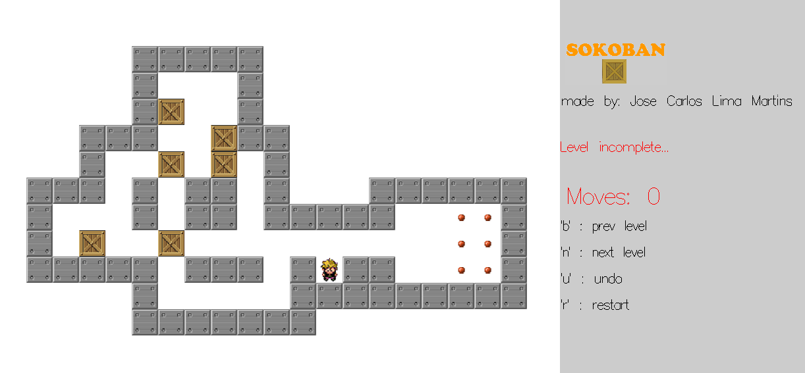
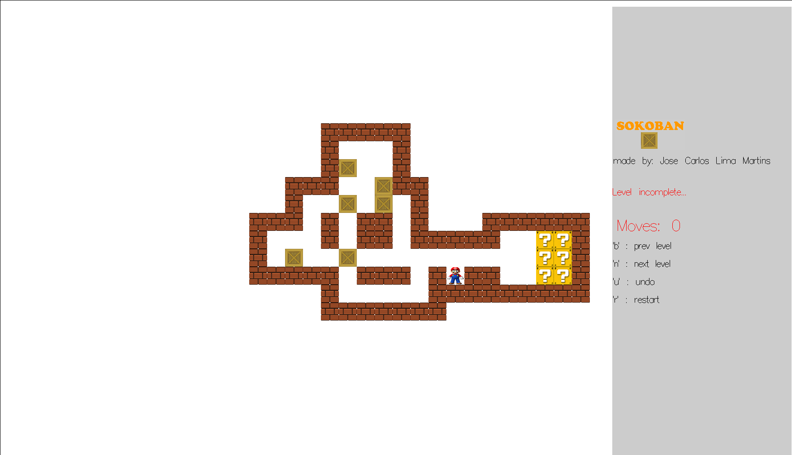
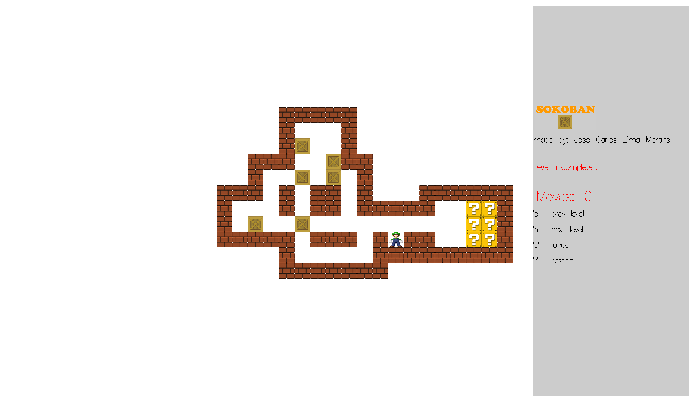
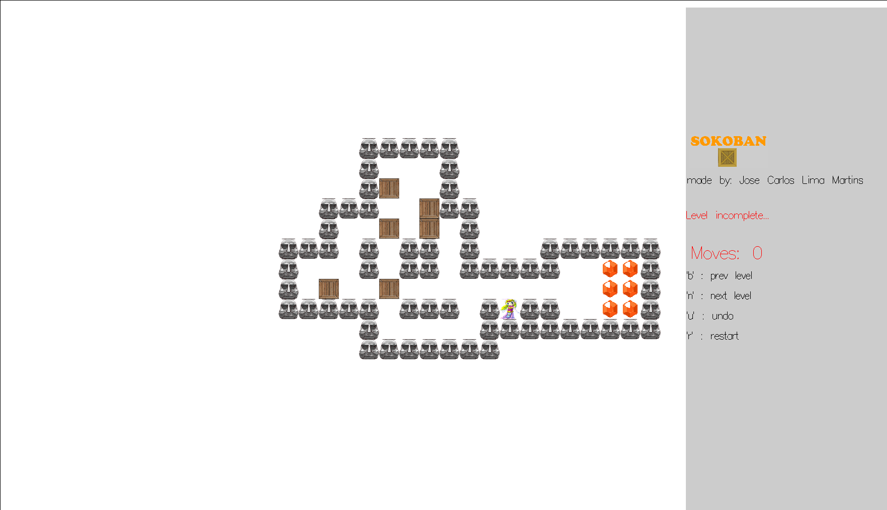
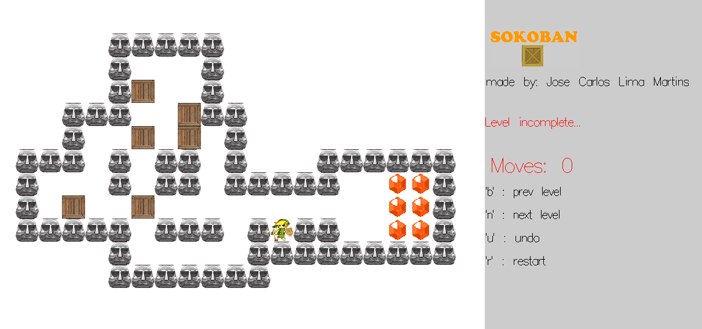

# 

[Sokoban](https://sokoban.info/) is a puzzle game invented in Japan. The objective of the game is to push crates to their proper locations with minimum number of moves.

This project was done for Computer Laboratories I at **Universidade do Minho** using [**Haskell**](https://www.haskell.org/).

## Usage

The game have different themes:

- Classic

- Mario

- Luigi

- Zelda

- Link 

The game have 5 different levels for now. 

During a level you can:
- restart: pressing 'r'
- undo: pressing 'u'
- go to prev level: pressing 'b'
- go to next level: pressing 'n'

## Setup

### Dependencies

- [OpenGL](https://www.opengl.org/about/)
- [freeGLUT](http://freeglut.sourceforge.net/)
- [stack](https://docs.haskellstack.org/en/stable/README/)

### Build

- clone the repository
- run install.sh

### Run

After building go to the *build* folder(inside the cloned folder) and run *Sokoban* executable file in command line: `./Sokoban`

## License

Licensed under the MIT License, see [LICENSE.md](LICENSE) for more details.
